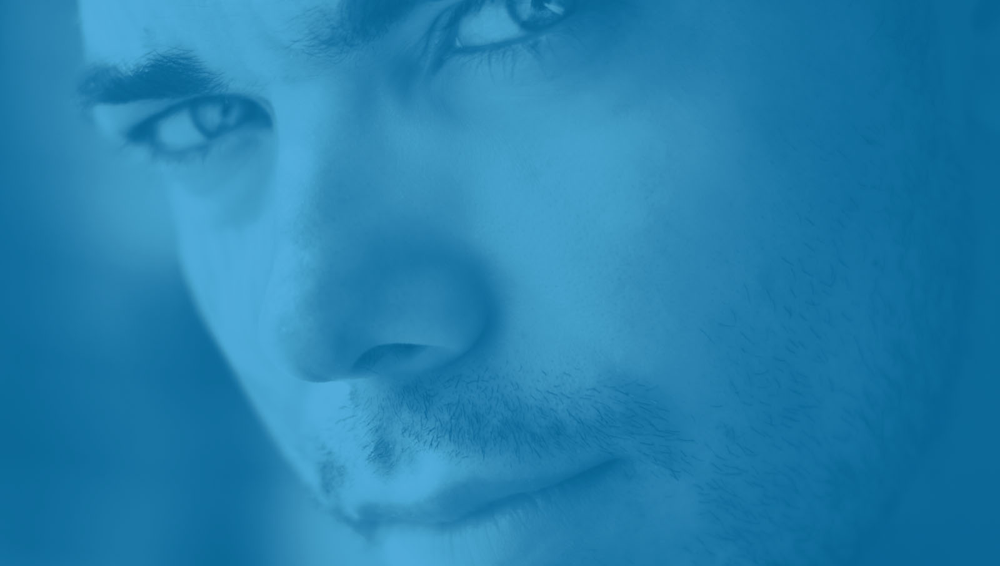
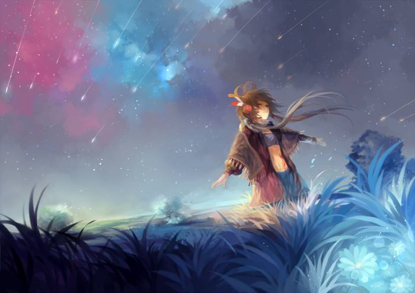
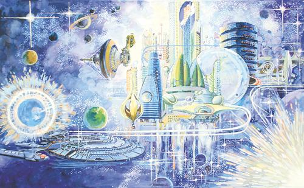
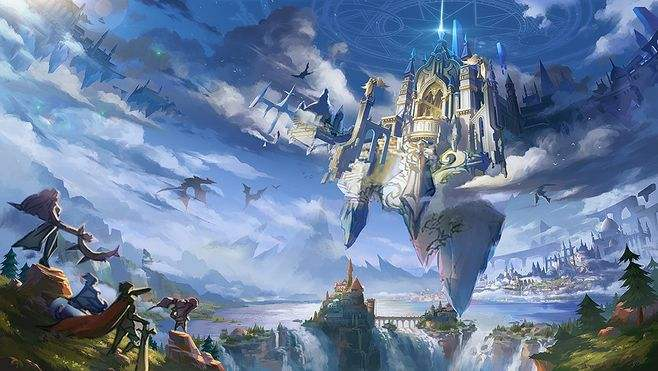

# 叶旭的个人网页      yex17@lzu.edu.cn

## 学习之道

- 科学的学习方法
- 批判的思维方式
- 熟练的技能
- 勤奋与坚毅的品质

----
   ## 生活

         

你要像你自己一样，好好活着！光影流水，悄无声息的流逝，你我的青春在平凡的日子里度过点点滴滴。生命带来的不仅仅是欢愉，还有生命本身需要承受的种种痛苦。总有人在寻找解除自己受到的种种禁制。

结果发现自己永远无法像鸟儿一样自由翱翔于天际。对于逍遥游理想，庄子一文，用自己的消极度过余生。但是这永远不是自己活着的意义。

试着去感受生活，生活永远是我们可以学习的精神场所。人类一直在世界。活着。对于我们不仅是满足自己个人的欲望，还要学会懂得世间的一切冷暖。只有这样，你才会变得坚强。梅花可以傲雪挺立，你也可以勇敢的追逐的梦想。

总有人和你一起成长，你只需要记住。你的脚步，走出的是你的道路。你不是那种通过模仿其他人的脚步去实现的自己人生的人物。我们都要面对人生的挫折与磨难。去学会和你喜欢的人，在一起生活，并且相处一生。

道路总是很多的，当你感受到自己的精神变得匮乏，自己的生命开始枯萎时，那么你就要开始注意了。20岁的你，还没有变老。身体机能还没有衰退，而你已经不在像当初的你，充满活力，身体散发着青春的气息。你再也找不到你曾经的模样。

生命不知眼前的苟且，还有远方和诗。

-----

## 未来                                                                  *2019.07.07*     

时光记住的总是那些经历风霜雨雪的日子。一个人在艰苦之中奋斗，希望为自己的未来的道路寻找到一些可能，于是不断地付出和努力。总之，许多人的理念是来自于其他人的，或是道听途说，或是自己逐渐在过去的岁月之中经历所感悟的人生。只是这些东西，都将我们引向未来的路途之中。生活，什么时候开始就不注意当下了！

我们感叹：这个世界的种种，可是才可以停留下来。你的梦想需要用一生的时光去追求，你对未来美好生活的渴望也确实值得嘉奖。不过，告诉你一件事。千万别把自己的梦想当成了幻想，也不要将历史当成故事，听完之后，一笑了之。人类最应该反思的其实是自己坚持千年的传统，因为方向一旦错了，那么你的努力也许会白费。重点并不是曾经那些给你指路的人，而是你是如何抉择自己的未来的。

生活总是会对一些人进行给予，而另外的一些人却得不到赏赐，他们看着那些人拥有自己所没有的东西时，便开始后悔！为什么自己努力了，却没有得到相应的回报，为什么我在付出了那么多之后，竟然一点也不开心。

许多人做事之前，总是希望自己得到回报的，那是生活所要求的，他们这样认为：人生就是从无到有，然后又从有到无的过程。是啊，你活着都是追求那些自己想得到的但是自己却没有拥有的东西。纵观整个人类而言，谁又不是这样。

凡事皆有始有终，何必去纠结结果如何。你总是告诉自己，我的人生，比其他人要崇高、伟大。你自己幻想自己站在高处，于是便近乎苛刻的对待自己，你要做得更好，你眼中的其他人都是普通的、平凡的人，他们选择了快乐，就是放弃了自己。你看他们这些人，从来就没有任何烦恼，作为一个伟大的高尚的人，怎么可能不会有烦恼呢，怎么可能会停下自己前进的步伐。快乐，是那些人应该拥有的东西，我没有必要拥有这些。

真实悲哀！你竟然将自己想象成苦修者，想象成高尚的人。你为自己失去的那些在其他人看来轻易可以得到的东西而寻找借口，试图去欺骗自己。你告诉自己：你知道他们为什么能够得到快乐吗？这个世界每个人承受的痛苦都是相同的，而他们的那一份，我替他们承受了。他们应该感谢我这样的人的存在。因为我们普渡了他们免于尘世的痛苦。

谎话说得越来越好，甚至来自己也不知道，今天的自己是第几次欺骗自己了。自己活在自己编织的梦里，你何曾真正的认识过人生，这个世界需要有人来刺破你们蒙蔽自己的黑布。

---------
## 光影记忆

有些人出现在我们眼前，然后从我们身边消失。曾几何时，有些人却牢牢印在我们的脑海中。对于生活，总会有人走在我们的前面，他们睿智，也许这些睿智来源于生活的经验，或者是其他的原因，让你变得 在众人之中显得如此与众不同。实际上，每一个都会有聪明的时候。可是，在这个零碎的世界里面，你要学会的，不仅仅是将自己的聪明发挥的淋漓尽致。

但是一些技巧性的技术活，不可以在现实之中，在自己的人生里面显得如此的尤为重要。实际看来，那些真正聪明的人，是对人生的明悟，而不是借助聪明技巧让自己走捷径的人。

很难想象，面前的老者，竟然如此安详，眼神之中流露出那份时间历练出的睿智。说实话，在这种人的面前，我竟然自己无法隐藏。

第一次在其他人面前，我感到奇怪。我害怕这种事情以后还会发生。不知为什么，面前的这个人，虽然有着让我感到害怕的一种从内心散发出来的力量。但是，他并没有用这种力量去压迫我。我感到幸运，遇到的是一个不知是好还是坏的人。但是他真的对我是一次震撼。

人类过着千百年最好的生活，却失去了最质朴，最纯粹的心灵。你的生命的意义的探索，一部分来自自己，另外一部分就是将自己置于现实的残酷的环境之中。人类总是要寻找自己未知的答案。
